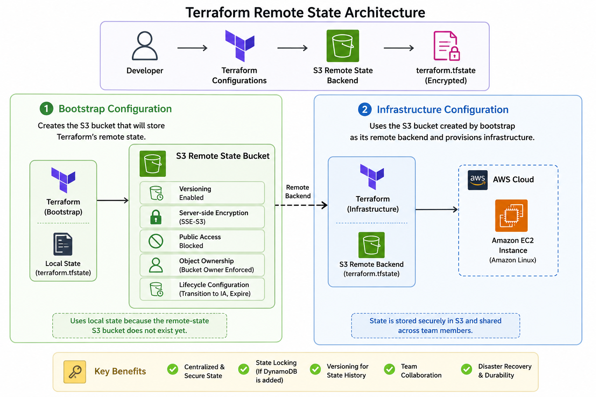

# Terraform Remote State Management on AWS

A practical Terraform remote state management project built using **Terraform, AWS S3, AWS EC2, AWS Systems Manager Parameter Store, and native S3 state locking**.

The project demonstrates how Terraform state can be securely stored and managed remotely using **Amazon S3**, with **S3 Versioning**, **server-side encryption**, **public access protection**, and **native Terraform state locking**.

The project uses a separate **bootstrap configuration** to provision the S3 remote-state bucket and a dedicated **infrastructure configuration** that uses the S3 bucket as its Terraform backend.

An EC2 instance is provisioned through the remote backend to demonstrate that Terraform infrastructure state is stored remotely in S3 rather than on the local machine.

---

## Project Architecture

The project is divided into two Terraform configurations.



### 1. Bootstrap Configuration

The `bootstrap` configuration is responsible for creating the AWS S3 bucket that will store Terraform's remote state.

The bootstrap infrastructure includes:

- S3 bucket
- S3 Versioning
- Server-side encryption
- Public access blocking
- Object ownership controls
- Lifecycle configuration

The bootstrap configuration initially uses **local Terraform state** because the remote-state S3 bucket does not exist yet.

This solves the Terraform backend bootstrap problem.

```text
Bootstrap Terraform
        │
        ▼
AWS S3 State Bucket
        │
        ├── Versioning
        ├── Encryption
        ├── Public Access Block
        ├── Object Ownership
        └── Lifecycle Configuration
```

### 2. Infrastructure Configuration

The `infrastructure` configuration uses the S3 bucket created by the bootstrap configuration as its remote Terraform backend.

It provisions a simple Amazon Linux EC2 instance.

```text
Infrastructure Terraform
        │
        ├──────────────► S3 Remote Backend
        │                    │
        │                    └── terraform.tfstate
        │
        ▼
    AWS EC2 Instance
```

This separation allows the S3 backend to be created before it is used by another Terraform configuration.

---

## Technologies Used

- **Git & GitHub** – Source code management
- **Terraform** – Infrastructure as Code and state management
- **AWS S3** – Remote Terraform state storage
- **AWS S3 Versioning** – Terraform state version history and recovery
- **AWS S3 Server-Side Encryption** – Encryption of Terraform state at rest
- **AWS S3 Public Access Block** – Protection against public bucket access
- **AWS S3 Object Ownership** – Bucket owner enforced object ownership
- **AWS S3 Lifecycle Configuration** – Cleanup of incomplete multipart uploads
- **AWS S3 Native State Locking** – Terraform state locking using S3 lock files
- **AWS EC2** – Example infrastructure resource
- **AWS Systems Manager Parameter Store** – Dynamic retrieval of the latest Amazon Linux 2023 AMI
- **AWS CLI** – Infrastructure and state verification
- **Amazon Linux 2023** – Operating system for the example EC2 instance
- **Git** – Version control and project history

---

## Repository Structure

```text
Terraform-Remote-State-Lab/
├── bootstrap/
│   ├── main.tf
│   ├── terraform.tfvars.example
│   ├── outputs.tf
│   ├── variables.tf
│   └── versions.tf
├── infrastructure/
│   ├── backend.tf
│   ├── main.tf
│   ├── outputs.tf
│   ├── terraform.tfvars.example
│   ├── variables.tf
│   └── versions.tf
├── screenshots/
├── .gitignore
├── LICENSE
└── README.md
```

---

## Terraform Remote Backend

The infrastructure configuration uses the S3 backend.

The backend stores Terraform state using a key similar to:

```text
terraform-remote-state-lab/
└── terraform.tfstate
```

The backend configuration includes:

```text
S3 Bucket
State Key
AWS Region
Encryption
S3 State Locking
```

The backend is initialized using:

```bash
terraform init
```

Terraform then reports:

```text
Successfully configured the backend "s3"!
```

This confirms that the infrastructure configuration is using the S3 remote backend.

---

## Terraform State Management

The project demonstrates the difference between local and remote Terraform state.

### Local State

The bootstrap configuration initially uses local state:

```text
bootstrap/
└── terraform.tfstate
```

This is necessary because the S3 backend must exist before another Terraform configuration can use it.

### Remote State

The main infrastructure configuration uses:

```text
Amazon S3
    │
    └── terraform.tfstate
```

The remote backend provides:

- Centralized state storage
- State version history
- Encryption
- State locking
- Better collaboration
- Reduced dependency on a developer's local machine

---

## Deployment

Follow these steps to deploy the project.

### 1. Clone the Repository

```bash
git clone https://github.com/Vaibhav-Wasamkar/Terraform-Remote-State-Lab.git
cd Terraform-Remote-State-Lab
```

### 2. Configure AWS Credentials

Make sure the AWS CLI is configured with credentials that have sufficient permissions to create and manage the required resources.

For example:

```bash
aws configure
```

Verify the configured identity:

```bash
aws sts get-caller-identity
```

### 3. Bootstrap Deployment

The bootstrap configuration must be deployed first because it creates the S3 bucket that will be used as the remote backend.

#### A. Navigate to Bootstrap

```bash
cd bootstrap
```

#### B. Create your Terraform variables file

```bash
cp ./terraform.tfvars.example terraform.tfvars
```

Or simply rename/copy:

```text
terraform.tfvars.example
        ↓
terraform.tfvars
```

Update the values in `terraform.tfvars` to match your AWS environment.

> **Note:** The `terraform.tfvars` file is intentionally excluded from Git to prevent committing environment-specific or sensitive configuration.

#### C. Initialize Terraform

```bash
terraform init
```

#### D. Review the Bootstrap Plan

Provide a globally unique S3 bucket name:

```bash
terraform plan
```

#### E. Create the S3 State Bucket

```bash
terraform apply
```

Enter:

```text
yes
```

when prompted.

Terraform will create:

```text
S3 Bucket
   │
   ├── Versioning
   ├── Encryption
   ├── Public Access Block
   ├── Object Ownership
   └── Lifecycle Configuration
```

### 4. Infrastructure Deployment

#### A. Navigate to Infrastructure

```bash
cd ../infrastructure
```

#### B. Configure the Backend

Update:

```text
infrastructure/backend.tf
```

with the exact S3 bucket name created during the bootstrap step.

The backend uses:

```text
Bucket
Key
Region
Encryption
S3 Lock File
```

#### C. Create your Terraform variables file

Navigate to the development environment and copy the example file:

```bash
cp ./terraform.tfvars.example terraform.tfvars
```

Or simply rename/copy:

```text
terraform.tfvars.example
        ↓
terraform.tfvars
```

Update the values in `terraform.tfvars` to match your AWS environment.

> **Note:** The `terraform.tfvars` file is intentionally excluded from Git to prevent committing environment-specific or sensitive configuration.

#### D. Initialize the Remote Backend

```bash
terraform init
```

Terraform should report:

```text
Successfully configured the backend "s3"!
```

#### F. Review the Infrastructure Plan

```bash
terraform plan
```

Terraform should show the EC2 instance that will be created.

#### G. Deploy the EC2 Instance

```bash
terraform apply
```

Enter:

```text
yes
```

when prompted.

Terraform will provision:

```text
EC2 Instance
        │
        ▼
Terraform State
        │
        ▼
Amazon S3 Remote Backend
```

---

## Verifying the Deployment

### Verify Terraform Resources

Run:

```bash
terraform state list
```

Expected resources include:

```text
data.aws_ssm_parameter.amazon_linux
aws_instance.example
```

### Verify Terraform State

Run:

```bash
aws s3 ls s3://<STATE-BUCKET>/ --recursive
```

The remote state should be visible at:

```text
terraform-remote-state-lab/terraform.tfstate
```

### Verify Terraform Configuration

Run:

```bash
terraform plan
```

Expected:

```text
No changes. Your infrastructure matches the configuration.
```

This confirms that Terraform can successfully read the remote state and that the deployed infrastructure matches the current configuration.

---

## Verifying S3 Versioning

Run:

```bash
aws s3api get-bucket-versioning \
  --bucket <STATE-BUCKET>
```

Expected:

```json
{
    "Status": "Enabled"
}
```

---

## Verifying S3 Encryption

Run:

```bash
aws s3api get-bucket-encryption \
  --bucket <STATE-BUCKET>
```

The bucket should report:

```text
AES256
```

---

## Verifying Public Access Protection

Run:

```bash
aws s3api get-public-access-block \
  --bucket <STATE-BUCKET>
```

Expected:

```json
{
    "BlockPublicAcls": true,
    "IgnorePublicAcls": true,
    "BlockPublicPolicy": true,
    "RestrictPublicBuckets": true
}
```

---

## Screenshots

Detailed screenshots demonstrating the implementation are available in the `screenshots/` directory.

The screenshots demonstrate:

1. S3 Versioning and encryption configuration.
2. S3 public access protection.
3. Terraform remote backend initialization.
4. EC2 instance running in AWS.
5. Terraform state stored remotely in S3.
6. Terraform state versioning change.
7. Actual Terraform state-locking behavior.
8. Final Terraform validation.

The strongest evidence includes:

```text
S3 State Bucket
       ↓
Remote Backend
       ↓
EC2 Provisioning
       ↓
Remote State
       ↓
State Versioning
       ↓
State Locking
```

---

## Security

Terraform state can contain sensitive infrastructure information, so protecting the state file is an important part of this project.

The project uses:

- S3 server-side encryption.
- S3 public access blocking.
- S3 Bucket Owner Enforced object ownership.
- AWS IAM permissions for AWS access.
- No hard-coded AWS access keys.
- `.gitignore` to exclude Terraform state files.
- `.gitignore` to exclude Terraform variable files.
- Remote state instead of storing the infrastructure state in Git.
- S3 Versioning for state recovery.

The following files are intentionally excluded from Git:

```text
.terraform/
*.tfstate
*.tfstate.*
*.tfvars
*.tfvars.json
```

Terraform state should **never be committed to the GitHub repository**.

---

## Project Workflow

The complete project workflow can be summarized as:

```text
                    GitHub Repository
                           │
                           ▼
                   Bootstrap Terraform
                           │
                           ▼
                    Secure S3 Bucket
                           │
              ┌────────────┼────────────┐
              │            │            │
         Versioning    Encryption    Security
              │            │            │
              └────────────┼────────────┘
                           │
                           ▼
                    S3 Remote Backend
                           │
                    ┌──────┴──────┐
                    │             │
              Remote State    State Locking
                    │             │
                    └──────┬──────┘
                           │
                           ▼
                 Infrastructure Terraform
                           │
                           ▼
                     Amazon Linux EC2
                           │
                           ▼
                    Terraform State
                           │
                           ▼
                      Amazon S3
```

---

## Key Concepts Demonstrated

This project provides practical experience with:

### Terraform State

Understanding what Terraform state is and why it is required to track infrastructure.

### Local vs Remote State

Understanding the difference between storing state locally and storing it centrally in an S3 backend.

### Terraform Backend

Configuring Terraform to use Amazon S3 as its remote backend.

### State Locking

Preventing concurrent Terraform operations from modifying the same state.

### State Versioning

Using S3 Versioning to preserve historical Terraform state versions.

### Bootstrap Problem

Understanding why the remote-state bucket must be created before Terraform can use it as a backend.

### Infrastructure Separation

Separating backend/bootstrap infrastructure from infrastructure that consumes the remote backend.

### Dynamic AMI Selection

Using AWS Systems Manager Parameter Store to dynamically retrieve the latest Amazon Linux 2023 AMI.

---

## Future Improvements

- Add separate Terraform environments such as development, staging, and production.
- Use separate state keys for different environments.
- Introduce reusable Terraform modules.
- Add IAM policies following least-privilege principles.
- Configure dedicated IAM roles for Terraform automation.
- Add CI/CD validation using GitHub Actions.
- Add `terraform fmt`, `terraform validate`, and `terraform plan` checks to pull requests.
- Add automated Terraform security scanning.
- Add infrastructure cost estimation.
- Add AWS CloudTrail monitoring for state bucket access.
- Configure S3 access logging where required.
- Add automated state backup and recovery procedures.
- Integrate the remote backend with a larger multi-environment infrastructure project.

---

## Project Outcome

This project demonstrates how **Terraform and AWS S3** can be used to implement a secure and reliable remote Terraform state management solution.

The project creates a dedicated S3 state bucket with:

- Versioning
- Server-side encryption
- Public access protection
- Object ownership controls
- Lifecycle management
- Native Terraform state locking

A separate Terraform infrastructure configuration then uses this S3 bucket as its remote backend and provisions an EC2 instance.

This project provides a practical demonstration of **Terraform remote state management, state locking, state versioning, AWS S3 security, backend configuration, Infrastructure as Code, and Terraform infrastructure lifecycle management**.
